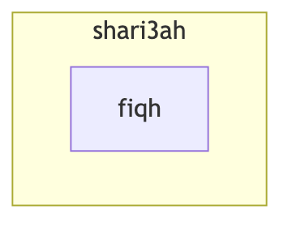
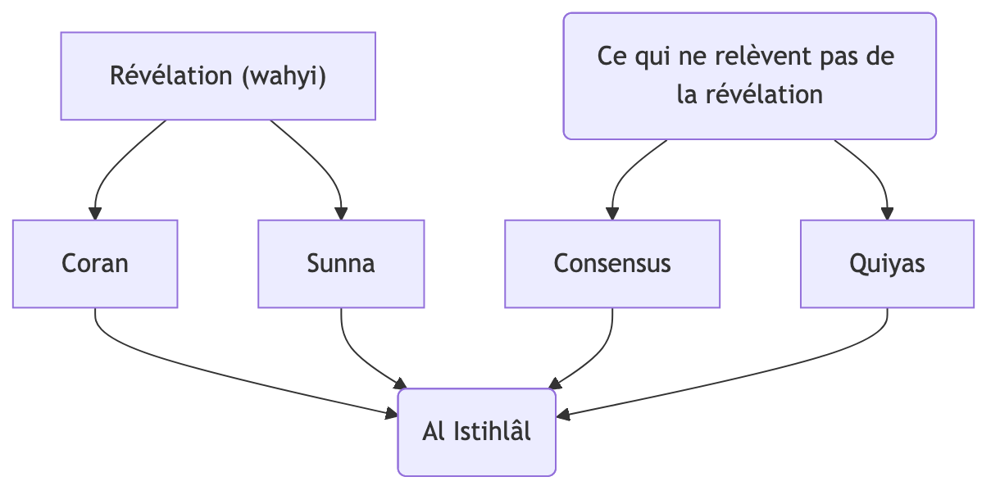
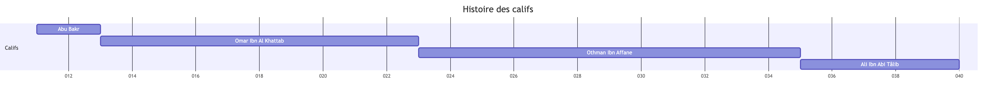
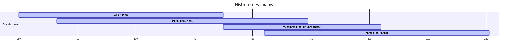

# Cours Fiqh

Chaque mot a un sens linguistique/étymologique et un sens terminologique

Fiqh = jurisprudence
	  = droit musulman

## Introduction - Méthode d'approche du Fiqh

### Qu'est-ce que le Fiqh فقه ?

1 - Sur le plan linguistique :
Terme fiqh dérivé du verbe faqiha/yafqahu/fiqhan qui a plusieurs significations

- la compréhension de manière absolue, comme le montre la parole d'Allah

> Ils dirent : « Ô Chuayb, nous ne comprenons pas grand-chose à ce que tu dis ; et vraiment, nous te considérons comme un faible parmi nous. Si ce n'est ton clan, nous t'aurions certainement lapidé. Et rien ne nous empêche de t'atteindre ». [11 Hud: 91]

> Les sept cieux et la terre et ceux qui s'y trouvent, célèbrent Sa gloire. Et il n'existe rien qui ne célèbre Sa gloire et Ses louanges. Mais vous ne comprenez pas leur façon de Le glorifier. Certes, c'est Lui qui est Indulgent et Pardonneur. [17 Al-Isra: 44]

- la compréhension fine et précise
- la connaissance d'une chose, car toute personne qui possède la science d'une chose, est considéré comme un faqih. Par la suite, ce terme a été spécifiquement employé pour désigner la science de la religion

2 - Sur le plan terminologique (religieux)

C'est ce qu'on traduit par droit musulman (ou jurisprudence), c'est ce qui désigne la compréhension des prescriptions juridiques pratiques de la shari3ah, celles auxquelles le musulman doit se conformer dans sa vie quotidienne. Elles englobent :

- Les adorations (al 3ibâdât) ou culte : prière, aumone zakat, jeûne saoum, pélerinage hajj
- Affaires sociales (mu3âmalât) : le commerce, le mariage, le divorce, les transactions, les contrats
- Le statut personnel (Al ahwâl achakhsiya) : tout ce qui concerne la famille de sa naissance à sa dissolution ; pension alimentaire
- Le droit constitutionnel (Al ahkam al sultâniyya) : les relations entre les gouvernants et le peuple
- Le droit international (Al ahkam)

### Qui est le Faqih ?

Le prophète ﷺ a fait allusion au terme Al Faqih (le juriste, celui qui comprend profondément la religion, les prescriptions juridiques) dans un hadith :

> Qu'Allah illumine le visage de celui qui entend une de nos paroles, la retient, puis là transmet telle qu'il l'a entendu. Car il se peut qu'une personne transporte un savoir religieux (fiqh) vers quelqu'un de plus savant qu'elle. Et il se peut aussi qu'un porteur de science soit lui-même un Faqih.

Ainsi, le Faqih (le juriste) est celui dont la compréhension englobe les divers domaines de la shari3ah, et qui possède la capacité ijtihâd (= effort d'interprétation) et de dérivation des règles à partir des textes du Coran et de la Sunna.

### Quelle est la différence entre le fiqh et shari3ah ?

Définition: la shari3ah c'est l'ensemble de tout ce qu'Allah a révélé à son prophète ﷺ pour guider l'être humain dans tous les domaines de la vie. Elle englobe :

- La croyance (al 3aqidah)
- Les adorations (al 3ibâdât)
- Les transactions (mu3âmalât)
- Les comportements (al akhlaq)
- La politique
- La justice
- La famille
- Les relations sociales
- L'économie

Et bien d'autres domaines.

En résumé la shari3ah c'est la révélation divine complète, ce qui est établi par un texte révélé (Coran ou Sunna) est appelé shari3ah.
Le fiqh, c'est la compréhension humaine de cette révélation dans les actes quotidiens.
Ce qui est déterminé par l'effort d'interprétation à la lumière des textes est appelé fiqh.
La shari3ah vient d'Allah, le fiqh vient de la compréhension des savants à partir du Coran et de la Sunna

### D'où puise-t-on les prescriptions juridiques ?

1. Wâjib (obligatoire) (récompensé si fait, punis si pas fait)
2. Moustahab (recommandé) (récompensé si fait, rien si pas fait)
3. Moubâh (permis) (récompensé si pour accomplir bonne action, rien si pas fait).> tout est permis si non interdit
4. Makrouh (déconseillé) (rien si pas fait, rien si fait)
5. Harâm (interdit) (récompensé si pas fait, punis si fait)

Tout musulman doit savoir que les prescriptions religieuses (permises, interdites, obligatoires, recommandées, déconseillées) ne sont pas inventées par les savants : elles viennent de sources précises fixées par Allah et son prophète ﷺ. Les savants appellent cela "Oussoul al fiqh" (= fondement de la jurisprudence), c'est-à-dire d'où le juriste tire une règle quand il veut savoir ce qu'Allah ordonne ou interdit.

### Les classifications des sources de la législation islamique

Les sources de la législation islamique ont été classées de plusieurs manières. Parmi ces classifications, on trouve celles qui distinguent entre sources admises par le consensus et sources faisant l'objet de divergence.

#### Les sources reconnues par l'ensemble des savants

Elles sont au nombre de 4.

1. Coran : la parole d'Allah révélée à son prophète ﷺ, c'est la source suprême. Toutes les règles y trouvent leur fondement direct ou indirect.
2. Sunna : tout ce qui vient du prophète ﷺ ; paroles, actes et approbations. Exemple : la prière, le Coran ordonne de prier, mais ne précise pas comment la faire. C'est la Sunna qui explique. Ainsi, le Coran donne le principe et la Sunna vient l'expliquer, le détailler et l'appliquer. On dit donc "Le Coran est la base, la Sunna est la clé pour le comprendre".

> Priez comme vous m'avez vu prier [Rapporté par Al Bukhâri]

> ... Tout ce que le prophète vous apporte, prenez-le et ce qu'il vous interdit, abandonnez-le ... [Sourate 59 Al-Hachr verset 7]

3. Consensus (Ijma3) : c'est quand tous les savants d'une époque sont d'accord sur une règle après la mort du prophète ﷺ. Cet accord devient une preuve légale. Exemple : le consensus des compagnons sur le fait que les cinq prières sont obligatoires
4. Raisonnement par analogie (Qiyâs)

> Tout ce qui enivre⁴ est Harâm³ [Hadith]

1. Le açl (l'origine)
2. Le far3 (dérivé) (exemple: drogue)
3. Le houkm (la règle)
4. La 3illa (la raison/cause en commun)

Le Qiyas est le fait de procéder par raisonnement

#### Divergence

1. L'Istihsân: la préférence juridique. Exemple: un taxi devrait informer du tarif avant le départ. Il ne le fait pas, car il applique l'istihsân pour simplifier
2. Al Istislah (Al maslaha al mursala): l'intérêt général
3. Al 3urf : coutume reconnue par rapport à l'endroit où tu vis, tant qu'elle ne contredit pas le Coran et la Sounna
4. Madhabou as sahâbi : l'avis d'un compagnon
5. Char3ou man quablama : les législations des anciens prophètes, exemple : Moussa, 3Issa

Ces sources secondaires montrent la profondeur et la flexibilité du fiqh islamique. Elles permettent aux savants de trouver des solutions nouvelles tout en restant fidèle à l'esprit du Coran et de la Sounna

(mufti: fait les règles != quâdi: juge, applique les règles)

### Les catégories de prescriptions juridiques en islam

On a deux catégories :

1. Prescriptions catégoriques = قطعة (ḥukm qaṭʿī) : ce sont les règles qui sont claires, évidentes et incontestables. Elles proviennent du Coran et de la Sounna et dont la signification ne laisse aucun doute. Elles sont catégoriques à deux niveaux:
   - dans leur preuve (قطعة الثبوت) texte authentique
   - dans leur sens (قطعة الدلالة) le texte ne peut être interprété autrement
2. Prescriptions conjecturales (al-aḥkām adh-dhanniyya) : ce sont celles dont le sens ou la preuve n'est pas absolument certain
   - le texte existe, mais il peut être interprété de plusieurs manières
   - la règle est déduite par ijtihâd (= efforts d'interprétation), à part d'indices, non pas d'un texte explicite

Pourquoi la diversité des avis ? C'est une sagesse divine qui permet une flexibilité à travers les époques. Cela prouve la richesse et la souplesse de la shari3ah

> Les fatwa changent selon le temps, le lieu sans jamais contredire les principes de la shari3ah [savant]

### La chronologie du fiqh

Différentes étapes :

1. Du vivant du prophète ﷺ
2. Du décès du prophète ﷺ jusqu'à la mort des quatre grands imams (école)
3. De la mort des 4 grands imams jusqu'à la chute du califat Ottoman (1924/1332H)
4. De la chute du califat Ottoman jusqu'à aujourd'hui

École de la rationalité => Al koufa (Iraq)
École du hadith => Hijâz

3 -> Apparition du chauvinisme des écoles

4.
- école juridique -> se basent sur 4 grandes écoles sans chauvinisme
- école traditionaliste (salafiste) -> réforme indépendante des grandes écoles

De nos jours, des institutions se sont créées pour faire des fatwas collectives.
