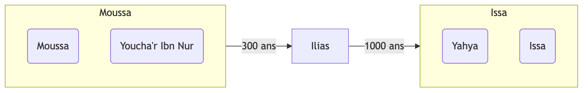

## La guerre des transgresseurs p40

Une guerre éclate entre le clan de Qinâna et le clan de Qays, suite à un assassinat fait par un membre de Qinâna. Le conflit aura lieu à la Mecque, et ils vont commettre le sacrilège de combattre en terre sainte. Quraych faisant partie de la famille de Qinâna, ils vont également participer à cette guerre. Le prophète ﷺ, âgé entre 14 et 20 ans, va participer à cette bataille sans combattre. Il va ramasser les flèches pour ses oncles. Cette guerre va durer plus d'un an.

À l'époque, les guerres pouvaient éclater pour des raisons futiles. Il y avait également un manque de respect du lieu sacré.

## Le pacte d'el-Fouďoûl p42

Fouďoûl est dérivé de Faďl = vertueux, mérite, noble

Après cette guerre, les Quraych vont signer un pacte moral pour établir et défendre la justice. Avec ce pacte, les Quraych se doivent d'aider toute personne victime d'une injustice. La justice passe avant la tribu. Même si la victime n'est pas Mecquois. Les clans les plus nombres de Quraych vont participer à ce pacte, et le prophète ﷺ va assister à ce pacte avec ses oncles.

L'injustice doit être combattue sous toutes ses formes.

## Deuxième voyage en Syrie p43

À 25 ans, le prophète ﷺ a un surnom : "le digne de confiance". Il est fiable dans les transactions. Une riche et noble commerçante, Khadîja, va faire appel à ses services pour mener une opération commerciale en Syrie.
Lors du voyage, plusieurs prodiges vont se manifester en faveur du prophète ﷺ, comme l'apparition d'un nuage qui le protégea de la chaleur du soleil.

## Le mariage avec Khadîja p44

Lorsque le prophète ﷺ rentre du voyage de Syrie, en voyant les bénéfices qu'il lui rapporte et en entendant les prodiges qui se sont produits, elle fut attirée par amour pour lui.
Elle lui proposa alors de se marier. Le prophète va alors demander sa main auprès de la famille de Khadîja.
Lors de la demande, Abû Tâlib va faire un discours pour rappeler la dignité de leur lignée, de la noblesse de Mohammed ﷺ.
Khadîja avait déjà un fils, nommé Hâla.

Le prophète ﷺ n'était pas intéressé par le physique, puisqu'il a épousé une femme qui a presque le double de son âge.

## La reconstruction de Ka3ba p45

Lorsque le prophète avait 35 ans, la Ka3ba est fragilisée suite à un incendie et des inondations.
Les arabes ont peur de la détruire pour la reconstruire, par respect pour sa sacralité.
Ils finiront par la détruire grâce à El-Walîd Ibn El-Mughîra qui leur rappelle que leur intention est bonne.
Les Quraychites collectent de l'argent en collectant de l'argent halal. Mais ils vont en manquer. Ils vont alors la reconstruire partiellement, en laissant un muret pour délimiter l'ancien périmètre.

Il y a eu une dispute lorsqu'il fallut replacer la pierre noire. Ils choisirent le prophète ﷺ comme arbitre. Celui-ci ﷺ va poser la pierre noire sur son manteau et demander à chaque tribu de tenir un bout du manteau. Comme ça chaque tribu porte tous ensemble la pierre noire. Il ﷺ finit par poser la pierre noire.

La ka3ba a été reconstruite au moins quatre fois :

- Par Ibrahim et Ismail (2000 ans av J.C)
- 5 ans avant la révélation Quraysh = incendie + inondation
- entre 683 et 684 ap J.C. (64H) par Abdullah Ibn Zubayr
- Abdel malik Ibn marwan 692 ap J.C. (72H)

## Sa vie avant la Révélation p50

Le prophète ﷺ est né orphelin et pauvre. L'état de dépouillement d'éloignement vis-à-vis des soucis de ce bas monde est une étape indispensable dans la vie des prophètes. Il ﷺ a été berger, comme tous les prophètes. Il ﷺ vécu dans l'aisance suite à son mariage avec Khadija.

## Son comportement au sein de son peuple avant la Révélation p51

Al 3isma, protection divine accordée aux prophètes :

- ils sont infaillibles dans la transmission du message -> ils ne commettent pas d'erreur
- ils sont infaillibles dans les grands péchés
- ils sont infaillibles dans ce qui contredit la mission prophétique

=> ils font des petites erreurs, mais ils ne mentent pas, ils ne se trompent pas sur la transmission du message, ils ne commettent pas de péchés.

Avant la prophétie, ils étaient protégés par Allah. Leurs erreurs ont été corrigées par Allah.

## Comment Allah l'a honoré avant la Révélation p54

- La bénédiction s'est répandue sur la famille de Halîma.

> Lorsqu'Allah met des gens au service d'un bienheureux, ces gens-là deviennent heureux

- L'ouverture de la poitrine et de l'extraction de la partie du Diable
- Le nuage qui le suivait durant son voyage en Syrie avec Maysara
- Le salut des pierres et des arbres

## L'annonce de sa venue dans la Thora p55

- Dans la Thora, la venue de plusieurs prophètes a été annoncée
- Il est écrit également que chaque imposteur ne perdurera pas et sera châtié -> or le prophète ﷺ ne l'a pas été

- Lors de l'arrivée de Yahia, des prêtres lui ont demandé s'il était 3Issa, Ilies ou ﷺ
- Plusieurs prédictions ont été faites par le prophète, qui venaient de la révélation

## La prédiction de l'Évangile

Paraclet = consolateur du grec Paraklétos = celui qu'on appelle à son secours

- Le paraclet (= ﷺ) va confondre le monde face à ses péchés
- Il ﷺ ne parlera pas sous l'effet de la passion
- La même chose est mentionnée dans le Coran

> Votre compagnon n'est ni égaré, ni mal intentionné. Et il ne prononce rien sous l’effet de la passion; Ce n’est rien d’autre qu’une révélation qui lui est faite. [Sourate 53 An-Najm verset 3-4]

## Le mouvement des idées avant la révélation p61

- Ce qui a conduit les Ansar de Médine vers l'Islam était ce qu'ils ont entendu des rabins et des juifs
- Les gens du livre attendaient l'arrivée du prophète ﷺ
- Certains savaient de l'arrivée ﷺ, mais parmi eux l'orgueil et la jalousie les ont empêchés de se convertir
- Le prophète ﷺ avait envoyé des messages aux rois de la terre, et aucun d'entre eux n'a méprisé sauf un. C'est parce qu'ils avaient les sciences du livre
