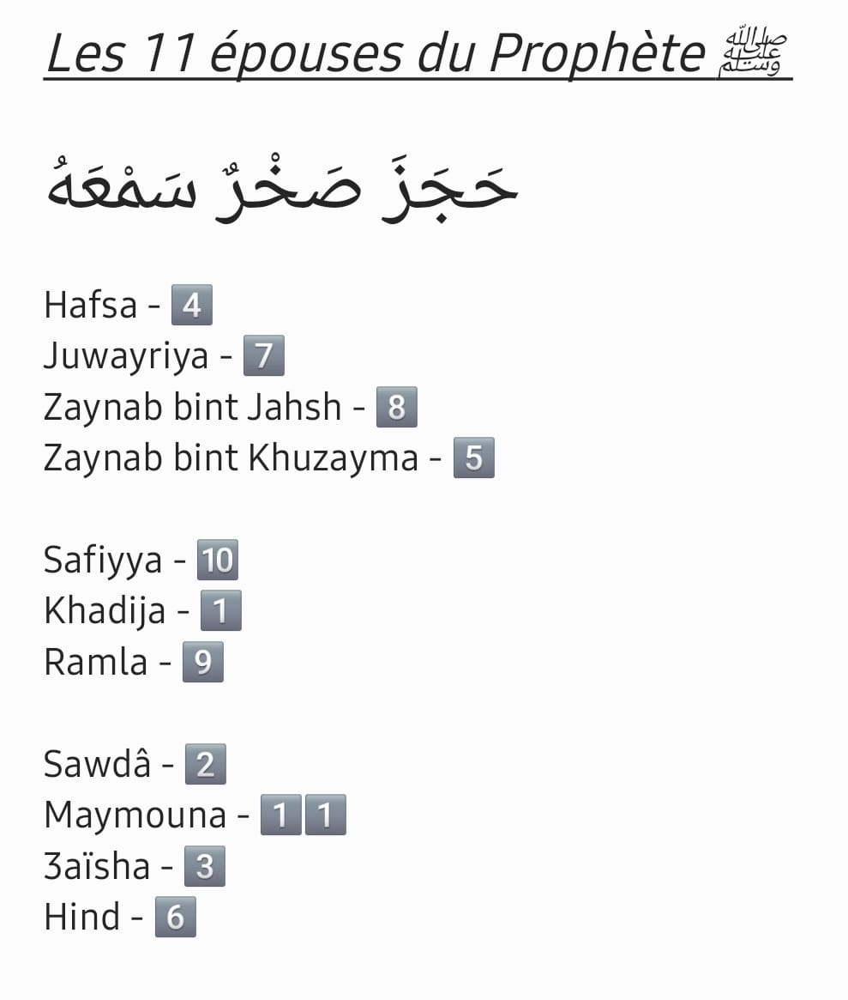

## La première émigration en Abyssinie p99

10 hommes et cinq femmes (certaines versions disent 12 hommes et 4 femmes) vont émigrer en Abyssinie. Seuls quelques compagnons restèrent avec le prophète. Ils voulaient protéger leur foi. Cette expédition fut dirigée par 3Uthman Ibn Madh3un.

## Les épouses du prophète

## La conversion de 3Umar p100

3Umar Ibn El-Khattâb était un adversaire farouche de l'Islam. Le prophète ﷺ avait fait une invocation pour demander la conversion du 3Umar qu'Allah préfère. Cette invocation fut exaucée par la conversion de 3Umar Ibn El-Khattâb.

Les détails de sa conversion, avec l'altercation avec sa sœur, ne sont pas authentiques. Néanmoins, sa conversion eut un fort impact sur les musulmans.

## Le retour des émigrants d'Abyssinie p101

Après trois mois d'absence, les musulmans d'Abyssinie revinrent après avoir entendu des rumeurs comme quoi les Quraychites s'étaient converties après avoir entendu les versets de Sourate n53 An Najm.

## La rédaction du feuillet p105

Le prophète ﷺ était protégé par son clan les 3Abd Manâf. Les Quraychites proposèrent une grande somme d'argent aux 3Abd Manâf, ce que les 3Abd Manâf refusèrent.

Les Quraychites proposèrent ensuite de l'échanger contre un jeune noble de leur clan, ce qu'Abû Tâlib trouva absurde.

Enfin, les Quraychites commença un embargo strict envers les clans 3Abd Manâf, Banû Hâchim, Banû El-Muttalib, en suspendant un pacte sur la Ka3ba. Ces clans se réfugièrent dans un ravin, et furent obligés de manger de feuilles pour survivre.

## La deuxième émigration en Abyssinie p106

Le prophète ﷺ ordonna aux musulmans de chercher refuge auprès du Négus en Abyssinie. Tous les clans sous embargo migrèrent sauf les Banû Hâchim, qui restèrent dans le ravin trois ans.

Les Quraychites vont tenter de faire des cadeaux au Négus pour récupérer les musulmans, mais il va refuser.

## Le désaveu du feuillet p107

Cinq dignitaires parmi les Quraychites exigèrent que le feuillet soit désavoué. Ils ne supportaient plus de voir les clans bannis souffrir de faim. Le feuillet fut alors retiré, même s'il avait déjà été détruit par les termites, à l'exception du nom d'Allah. Les victimes de la quarantaine purent alors revenir chez eux.

## Les délégations de Najrâne p108

Des chrétiens de Najrâne entendent parler du prophète ﷺ et vont aller à la Mecque afin découvrir les caractéristiques du prophète ﷺ. Ils vont se convertir immédiatement après avoir entendu le Coran. Abû Jahl va les traiter de sôt. Allah va alors révéler les versets 52-55 de la Sourate 28 Al-Qasas.

> Ceux à qui, avant lui [le Coran], Nous avons apporté le Livre, y croient. Et quand on le leur récite, ils disent : "Nous y croyons. Ceci est bien la vérité émanant de notre Seigneur. Déjà avant son arrivée, nous étions soumis." Voilà ceux qui recevront deux fois leur récompense pour leur endurance, pour avoir répondu au mal par le bien, et pour avoir dépensé de ce que Nous leur avons attribué; et quand ils entendent des futilités, ils s’en détournent et disent : "A nous nos actions, et à vous les vôtres. Paix sur vous. Nous ne recherchons pas les ignorants." [Sourate 28 Al-Qasas verset 52-55](https://quran.com/28/52-55)

## Le décès de Khadîja p109

Peu après sa sortie des ravins de La Mecque, trois ans avant l'émigration, Khadîja mourut. Elle lui donna tous ses enfants à l'exception de Ibrahim, dont la mère était Mâriyya la copte. Elle fut la première croyante et son premier soutien moral et financier.

## Le mariage avec Sawda p110

Dans le mois suivant, le prophète ﷺ se maria avec Sawda, qui était veuve. Elle faisait partie des émigrés en Abyssinie. Il se maria avec elle pour la protéger et la préserver, car elle était veuve, seule et sans protection malgré son noble rang.

## Le mariage avec 3Aicha p110

- C'était un mariage noble et pur.
- Choisi par Allah avec sagesse
- S'inscrit dans un cadre religieux et éducatif profond

Beaucoup de ces critiques viennent d'une erreur : appliquer les normes d'aujourd'hui à une époque complètement différente.

Ibn Kathir disait au 8ᵉ siècle qu'il était courant de marier les filles quand elles sont jeunes.

Le vrai problème aujourd'hui n'est pas le mariage, mais notre regard moderne.

Cela n'a suscité aucune critique à cette époque.

## La mort d'Abu Talib p111

Abu Talib n'a pas traité le prophète ﷺ de menteur, mais il n'a jamais récité l'attestation de foi.

Le prophète a tenté à plusieurs reprises de lui faire dire l'attestation de foi, il a hésité, mais les mushkrines l'ont convaincu de rester dans la religion de ses ancêtres.

Allah a révélé par la suite :

> Tu (Mohammed) ne guides pas celui que tu aimes, mais c’est Allah qui guide qui Il veut. Et Il connaît mieux cependant les bien-guidés. [Sourate 28 Al-Qasas verset 56]

## L'année de la tristesse p112

Le prophète nomma cette année, l'année de la tristesse suite à ces deux décès.

Les Quraychites se sont encore plus acharnés sur le prophète ﷺ.
