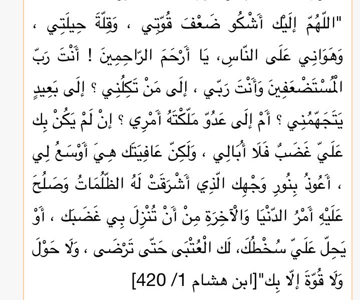

## L'émigration à Al-Tâïf

Face à l'entêtement des Quraychites, le prophète ﷺ chercha refuge auprès des Thaqîf de Al-Tâïf. Ceux vont le rejeter et même le blesser en lui jetant des pierres.

D'après certains historiens, ce voyage aurait duré une dizaine de jours, après la mort de Abû Tâlib et Khadija.

Le prophète ﷺ s'est rendu à Al-Tâïf parce que c'était une ville importante sur le plan économique et tribale pour les Quraychites. Il cherchait un soutien pour pouvoir continuer à transmettre le message de l'islam en sécurité. Cela aurait pu affaiblir Quraych et réduire leur pression sur lui.

À Al-Tâïf, les principales tribus étaient les Thaqîf, ainsi que les Banî Mâlik et Ahlâf. Pour se protéger, ils ont fait des alliances avec les Quraychites.

Sur le retour, le prophète a fait cette invocation :

> Seigneur, c'est à Toi (seulement) que je confie mes peines. Je me plains à toi de ma faiblesse, de ma situation si fragile, mon manque de moyens, et des hontes qu'on m'afflige... O Toi Qui est Le Plus Miséricordieux des miséricordieux.
> Tu es le Seigneur des faibles et des opprimés, et Tu es mon Seigneur. A qui me confies-Tu, mon cher Seigneur ? A un étranger qui me méprise et me haït... ou à un ennemi, entre les mains duquel tu m'as mis ?
> Aussi longtemps qu'il n'y a pas en Toi de colère à mon sujet, alors je ne grognerais pas. Mais ton salut m'est préférable (vis-à-vis de ma situation)...
> Je me réfugie en Ta Lumière, qui a effacé les ténèbres, et rétablit les affaires d'ici-bas et de l'au-delà, de sorte que ne tombe jamais sur moi Ta Colère, ou que Ton irritation ne demeure sur moi. Je me soumet à Ton Décret totalement et me repens à toi, jusqu'à ce que tu sois Satisfait, et il n'y a de force et de pouvoir qu'en Toi.. Amîn

Même face à la souffrance, le prophète ﷺ continuait d'avoir de la compassion pour son peuple. Pour lui, ce jour-là fut le jour le plus dur mentalement que le prophète ﷺ ait vécu.

[... histoire avec 3Addas et Younous]

Sur le chemin du retour vers La Mecque, le prophète ﷺ receva la visite de Djinns de confession israélite. Après avoir écouté le Coran, ils vont se convertir à l'islam et vont transmettre le message à leur peuple.

Allah révéla ces versets sur les Djinns en question :

https://quran.com/46/29-32

Ce qu'on peut retenir :

- La patience et la fermeté dans la prédication de l'islam
- Chercher de nouvelles opportunités face aux obstacles, avec persévérance
- La prédication ne donne pas forcément des résultats immédiats
- Garder espoir malgré les épreuves, rester optimiste
